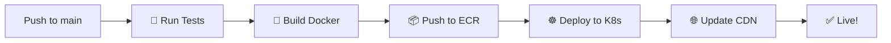

# Andy Meier

[](https://github.com/meiermade/andymeier/actions/workflows/deploy.yml)
[](https://opensource.org/licenses/MIT)
[](https://dotnet.microsoft.com/download/dotnet/8.0)
[](https://fsharp.org/)

> **Personal website and portfolio for Andy Meier** - A modern, performant web application showcasing projects, services, and technical articles built with functional programming principles.

---

## 📖 Table of Contents

<details>
<summary>🧭 Navigate this README</summary>

- [🌟 Quick Start](#-quick-start)
- [🌐 About](#-about)
- [✨ Features](#-features)
- [🛠 Tech Stack](#-tech-stack)
- [🚀 Getting Started](#-getting-started)
  - [Prerequisites](#prerequisites)
  - [Development Setup](#development-setup)
  - [Running Tests](#running-tests)
- [📁 Project Structure](#-project-structure)
- [🚢 Deployment & CI/CD](#-deployment--cicd)
- [🤝 Contributing](#-contributing)
- [🎯 Roadmap](#-roadmap)
- [💬 Get in Touch](#-get-in-touch)
- [📜 License](#-license)

</details>

---

## 🌟 Quick Start

**Want to get up and running fast?** Here's the express lane:

```bash
# 1️⃣ Clone & navigate
git clone https://github.com/meiermade/andymeier.git
cd andymeier/app

# 2️⃣ Setup & run
dotnet tool restore && dotnet paket restore
./fake.sh Watch

# 3️⃣ Open browser to displayed URL ✨
```

**New to F# or functional programming?** Don't worry! This project is designed to be approachable. Check out the [Contributing](#-contributing) section for helpful resources.

---

## 🌐 About

This is **Andy Meier's personal website** - a showcase of modern web development using functional programming. Built with F#, it demonstrates clean architecture, fast performance, and beautiful design.

**What makes this special?**
- 🎯 **Functional-first approach** - Immutable data, pure functions, composable design
- ⚡ **Performance optimized** - Server-side rendering with minimal JavaScript
- 🎨 **Modern UX** - Responsive design with Datastar for enhanced interactions
- 🔧 **Developer experience** - Hot reloading, comprehensive testing, automated deployment

---

## ✨ Features

### 🏆 For Visitors
- **📱 Responsive Design** - Perfect on mobile, tablet, and desktop
- **⚡ Lightning Fast** - Optimized loading and smooth interactions
- **🎨 Clean Interface** - Focus on content with beautiful typography
- **🔍 Easy Navigation** - Find what you're looking for quickly

### 🛠 For Developers
- **🧪 Comprehensive Testing** - Unit tests with Expecto
- **🔄 Hot Reloading** - See changes instantly during development
- **📦 Modern Tooling** - FAKE builds, Paket dependencies, Docker ready
- **🚀 Automated Deployment** - Push to main and deploy automatically

### 📝 Content Sections
- **💼 Portfolio Showcase** - Featured projects with detailed breakdowns
- **🎯 Service Offerings** - Professional services and expertise areas  
- **✍️ Technical Blog** - Articles, tutorials, and insights
- **📬 Contact & Connect** - Multiple ways to get in touch

---

## 🛠 Tech Stack

### Frontend Stack
```
F# + Giraffe           🦒 Functional web framework
Datastar              ⭐ Reactive UX enhancements  
Tailwind CSS          🎨 Utility-first styling
FSharp.ViewEngine     🏗️ Server-side HTML generation
```

### Backend & Data
```
SQLite                🗄️ Local database
Notion API            📝 Content management
Markdig               📖 Markdown processing
```

### Infrastructure
```
Docker                🐳 Containerization
Kubernetes            ☸️ Orchestration
AWS ECR               📦 Container registry
Cloudflare            🌐 CDN and DNS
Pulumi                🏗️ Infrastructure as Code
GitHub Actions        🔄 CI/CD pipeline
```

---

## 🚀 Getting Started

### Prerequisites

Before diving in, make sure you have these tools installed:

| Tool | Version | Purpose | Download |
|------|---------|---------|----------|
| .NET SDK | 8.0+ | F# runtime & tooling | [Download](https://dotnet.microsoft.com/download/dotnet/8.0) |
| Node.js | 24.x | Pulumi infrastructure | [Download](https://nodejs.org/) |
| Docker | Latest | Containerization | [Download](https://docker.com/) |

### Development Setup

#### Step 1: Clone and Navigate
```bash
git clone https://github.com/meiermade/andymeier.git
cd andymeier
```

#### Step 2: Setup Application Dependencies
```bash
cd app
dotnet tool restore    # Install FAKE and other tools
dotnet paket restore  # Install F# packages
```

#### Step 3: Start Development Server
```bash
./fake.sh Watch
```

🎉 **Success!** Your development server is running with hot reloading enabled. Open the displayed URL in your browser.

#### Step 4: Setup Infrastructure (Optional)
```bash
cd ../pulumi
npm install           # Install Pulumi dependencies
```

### Running Tests

Ensure everything works correctly:

```bash
cd app
./fake.sh Test        # Run all tests
```

**Test coverage includes:**
- ✅ Domain logic validation
- ✅ API endpoint testing  
- ✅ Database operations
- ✅ View rendering

---

## 📁 Project Structure

```
andymeier/
├── 🎯 app/                       # F# Web Application
│   ├── src/
│   │   ├── App/                  # Main web application
│   │   │   ├── src/
│   │   │   │   ├── Index/        # 🏠 Homepage handlers & views
│   │   │   │   ├── Projects/     # 💼 Project showcase
│   │   │   │   ├── Services/     # 🎯 Service offerings
│   │   │   │   ├── Articles/     # ✍️ Blog/articles
│   │   │   │   └── Common/       # 🔧 Shared components
│   │   │   ├── Config.fs         # ⚙️ Application configuration
│   │   │   └── Program.fs        # 🚀 Application entry point
│   │   ├── Domain/               # 🏗️ Domain logic & data access
│   │   │   ├── Notion.fs         # 📝 Notion API integration
│   │   │   ├── Sqlite.fs         # 🗄️ Database operations
│   │   │   └── ...
│   │   ├── Build/                # 🔨 FAKE build scripts
│   │   └── Tests/                # 🧪 Expecto tests
│   ├── paket.dependencies        # 📦 Package dependencies
│   └── fake.sh                   # 🏃 Build script runner
├── ☁️ pulumi/                    # Infrastructure as Code
│   ├── src/                      # 🏗️ Pulumi TypeScript modules  
│   ├── index.ts                  # 🌐 Main infrastructure definition
│   └── package.json              # 📦 Node.js dependencies
├── 🔄 .github/workflows/         # GitHub Actions CI/CD
└── 📖 README.md                  # This file
```

**Key Directories Explained:**
- **`app/src/App/`** - The heart of the web application with all pages and components
- **`app/src/Domain/`** - Business logic, data models, and external integrations
- **`pulumi/`** - Complete infrastructure definition for AWS/Kubernetes deployment
- **`.github/workflows/`** - Automated testing, building, and deployment pipelines

---

## 🚢 Deployment & CI/CD

### Automated Deployment Pipeline

Every push to `main` triggers this sophisticated deployment process:



### Infrastructure Management

**🏗️ Pulumi handles everything:**
- AWS infrastructure provisioning
- Kubernetes cluster management
- Docker registry setup
- CDN configuration
- SSL certificate management

### Manual Operations

```bash
# Preview infrastructure changes (safe)
cd pulumi && pulumi preview

# ⚠️ NEVER run this manually - CI handles it
# pulumi up
```

**🚨 Important:** All infrastructure changes happen automatically through CI/CD. Manual `pulumi up` commands can cause deployment conflicts.

---

## 🤝 Contributing

### 🚀 Ready to Contribute?

We welcome contributions! Here's how to get started:

#### Pre-Pull Request Checklist ✅

Before creating a pull request, make sure:

- [ ] **🧪 Tests Pass** - Run `cd app && ./fake.sh Test`
- [ ] **🏗️ Infrastructure Valid** - Run `cd pulumi && pulumi preview` (no errors)
- [ ] **📝 Code Formatted** - Follow F# formatting conventions
- [ ] **📖 Documentation Updated** - Update relevant docs if needed

#### Development Workflow

1. **🌱 Create Feature Branch**
   ```bash
   git checkout -b feature/your-awesome-feature
   ```

2. **💻 Make Your Changes**
   - Write code, tests, documentation
   - Use descriptive commit messages

3. **🧪 Test Everything**
   ```bash
   cd app && ./fake.sh Test
   cd ../pulumi && pulumi preview
   ```

4. **📝 Create Pull Request**
   - Clear description of changes
   - Link to any related issues
   - Screenshots if UI changes

5. **⏳ Wait for Review**
   - Automated checks will run
   - Address any feedback
   - Celebrate when merged! 🎉

#### New to F#?

**Great resources to get started:**
- [F# for Fun and Profit](https://fsharpforfunandprofit.com/) - Excellent learning resource
- [F# Foundation](https://fsharp.org/) - Official F# documentation
- [Giraffe Documentation](https://giraffe.wiki/) - Web framework docs

---

## 🎯 Roadmap

### 🔮 What's Coming Next

#### 🎨 Enhanced User Experience
- [ ] **📚 Table of Contents Sidebar** - Sticky navigation for long content
- [ ] **📊 Reading Progress Indicators** - Track progress through articles
- [ ] **⏭️ Next/Previous Navigation** - Easy content discovery
- [ ] **🔍 Search Functionality** - Find content quickly
- [ ] **🌙 Dark Mode Toggle** - Theme customization

#### 🏗️ Technical Improvements  
- [ ] **⚡ Performance Optimization** - Further speed improvements
- [ ] **📱 PWA Features** - Offline support, app-like experience
- [ ] **🔐 Enhanced Security** - Additional security headers and CSP
- [ ] **📊 Analytics Integration** - Privacy-focused usage insights
- [ ] **🌍 Internationalization** - Multi-language support

#### 📝 Content Expansion
- [ ] **📚 More Technical Articles** - Deep-dives into F# and functional programming
- [ ] **💼 Additional Project Showcases** - More portfolio pieces
- [ ] **🎥 Video Content** - Tutorials and walkthroughs
- [ ] **💬 Comment System** - Engage with readers

### 💡 Have Ideas?

**We'd love to hear from you!** 
- 🐛 Found a bug? [Open an issue](https://github.com/meiermade/andymeier/issues)
- 💡 Have a feature idea? [Start a discussion](https://github.com/meiermade/andymeier/discussions)
- 🤝 Want to contribute? Check the [contributing guide](#-contributing) above

---

## 💬 Get in Touch

**Let's connect!** Whether you're interested in collaboration, have questions about the project, or just want to chat about functional programming:

- 🌐 **Website**: Visit [andymeier.com](https://andymeier.com) for the full experience
- 💼 **Professional**: Connect on LinkedIn
- 📧 **Email**: Reach out through the website's contact form
- 💬 **Discussion**: Use [GitHub Discussions](https://github.com/meiermade/andymeier/discussions) for project-related conversations

**Interested in F# consulting or functional programming projects?** The Services section of the website has all the details!

---

## 📜 License

This project is open source and available under the **[MIT License](LICENSE)**.

```
MIT License - do whatever you want with this code!
Just keep the copyright notice. That's it. 🎉
```

---

<div align="center">

**Built with ❤️ using F# and functional programming principles**

*"Code is poetry written for machines to execute and humans to understand"*

[⬆️ Back to Top](#andy-meier) | [🏠 Visit Website](https://andymeier.com) | [🤝 Contribute](#-contributing)

</div>